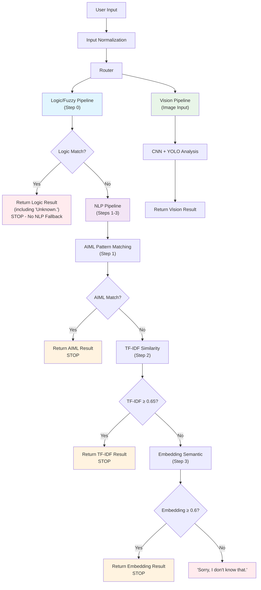

# Architecture Overview

## High-level Flow

User Input → Normalize → Router → [Logic/Fuzzy → AIML → TF-IDF → Embedding → Vision] → Response

**Pipeline Behavior:**
- **Logic/Fuzzy Pipeline**: Runs first for fact assertions, fact checks, and safety queries. Returns result and stops (no NLP fallback)
- **NLP Pipeline**: Only runs if Logic/Fuzzy doesn't match. AIML → TF-IDF → Embedding fallback chain
- **Vision Pipeline**: Triggered by image input syntax or natural language image queries
- If all modules return None, router prints "Sorry, I don't know that."

## Modules

- **nlp/**: Natural language processing (input normalization, similarity matching, embeddings)
- **logic/**: Logic reasoning (FOL, fuzzy safety) - **separate pipeline, no NLP fallback**
- **image_classification/**: Utensil image detection and classification (CNN + YOLO)
- **main.py**: Chatbot interface and router (centralized threshold management)

## Data
- `qna.csv`: Q/A pairs for similarity and semantic matching (includes generic and specific questions for all utensils, with paraphrases and common misspellings)
- `logical-kb.csv`: Knowledge base for logic reasoning

## Pipeline Details

### **Logic/Fuzzy Pipeline (Step 0 - Runs First)**
- **Fuzzy Safety Queries**: "Is X safe for children?", "How safe is X?"
- **Fact Checking**: "Check that X is Y" → Returns "Correct.", "Incorrect.", or "Unknown."
- **Fact Assertions**: "I know that X is Y" → Adds facts with material inference
- **Material Inference**: Universal quantification (e.g., "wood is microwave safe" → applies to all wooden utensils)
- **No NLP Fallback**: Logic results (including "Unknown.") stop here - no mixing with NLP responses

### **NLP Pipeline (Steps 1-3 - Only if Logic doesn't match)**
- **AIML:** Exact pattern match (e.g., "What is a colander?")
- **TF-IDF:** Token-based similarity (threshold 0.65, centralized)
- **Embedding (spaCy):** Semantic similarity (threshold 0.6)
- **Input normalization** is applied before all NLP steps (lowercase, punctuation, contractions, spelling correction)

### **Vision Pipeline (Step 4 - Image Input)**
- **Direct Syntax**: "image: path/to/image.jpg" → Uses both CNN + YOLO
- **Natural Language**: "What is in this image?" → CNN classification
- **Multi-Object**: "Detect everything in this image" → YOLO detection with annotations

## Pipeline Flow Diagram



## Planned API
- `nlp.similarity.reply(text, context)`
- `logic.logic_engine.reply(text, context)`
- `image_classification.yolo_detector.detect(image_path)`

### Image Classification Classes
The YOLOv8 model is trained to detect the following utensil classes:
- Blender
- Bowl
- Canopener
- Choppingboard
- Colander
- Cup
- Dinnerfork
- Dinnerknife
- Fishslice
- Garlicpress
- Kitchenknife
- Ladle
- Pan
- Peeler
- Saucepan
- Spoon
- Teaspoon
- Tongs
- Tray
- Whisk
- Woodenspoon

## Fuzzy Logic Safety (Simpful)

```mermaid
flowchart TD
    Sharpness[Sharpness (0-10)] --> Fuzzy["Fuzzy System (Simpful)"]
    Grip[Grip (0-10)] --> Fuzzy
    Fuzzy -->|Rules| Safety[Safety (low/moderate/high)]
```

- Inputs: Sharpness, Grip (0–10 scale)
- Output: Safety (low, moderate, high)
- Rules: e.g., "IF sharpness IS high AND grip IS poor THEN safety IS low"
- Used for queries like: "Is a peeler safe for children?" 